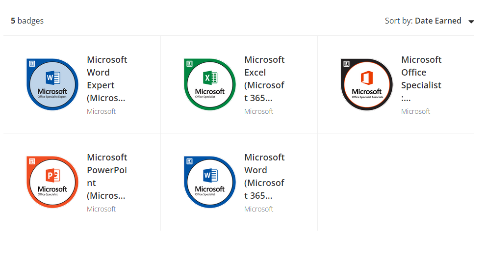

# Task 1

# Timeline

Here is the timeline I made estimating how and when I'll get everything done. Hopefully I will have things done by these dates but who knows.

    Herb 23/05/22

# Storyboard

With my storyboard I started off with these first two pages that were pretty underdeveloped.

I made these designs just from the top of my head after looking at a few portfolios.
Giving it a go I didn't really jive with the vibe of it all so I took a step back and started over. I looked at some more portfolios online and came up with some more ideas of what to use in mine and eventually I made these boards.

I wanted to create something simple and not too complex. Something that showed off my skills but also felt like it represented a piece of me and showed it off.

The design was pretty simple and with this new set of boards ready I got to work piecing the website together.

After setting up a basic page I made some progress and tried out using an animated navigation bar that would slide into the page and have links to the other pages.

    Herb 23/05/22

Here is how the website is looking so far.

# Asset list

Most assets I planned to use were photos, designs and personal achievements that I wanted to show.

I sat down and made this list of what exactly I would show off.

- Microsoft Office Specialist awards

- Previous work from last year (Logo, Photoshop stuff, maybe presentation?)

- My Unit 13 Website I had just created.

Aside the use of assets made by me I used very little in terms of others assets aside from borrowing and using snippets of code from the website W3Schools, a website built to teach and inform on how to do a variety of things with CSS or Html code among other things.

Specifically:

- Overlay effect

<https://www.w3schools.com/howto/howto_css_overlay.asp>

- CSS Animation

<https://www.w3schools.com/css/css3_animations.asp>

Other parts of code have also been lifted from my last project for Unit 13 as it was a nice easy base to start building off.

Other than the code from W3Schools the only other thing I've taken from an outside source are the badge images from Certiport / Microsoft, all of which I myself had earned by taking their exams.

    Herb 23/05/22

# Portfolio

Here is a quick jumble of ideas in list form that I could use for my portfolio.

- Mos specialist awards (Excel, Word, Powerpoint, Word/Excel Expert)
- Examples of my photo editing work
- Tinkercad work
- possibly artwork
- (Youtube from that one unit ?)
- Unit 13's phone website

There's probably more but this is the stuff that seems relevant if I were to pursue a job in IT.

#

    28/05/22 - 07/06/22

# Testing

Things I tested:

+ Screen width
+ Different Web browsers
+ Navigation links

I tested the website on a few other browsers alongside that I made sure all the navigation links work and tested how the pages reacted to varying page widths.

I had no issues in the end using alternate browsers and the navigation links worked just fine. The only issue I had found was that the page width on the portfolio tab was a bit scuffed when the web width was altered.

